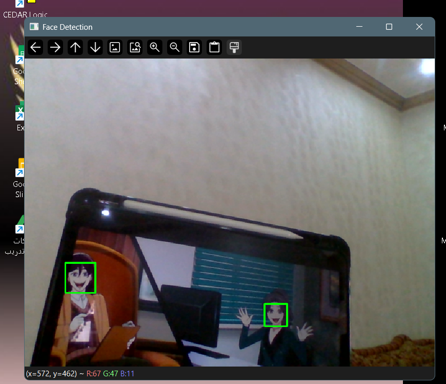

# Real-Time Face Detection using OpenCV and Jupyter Notebook

This project demonstrates how to perform real-time face detection using OpenCV in a Jupyter Notebook environment. It uses Haar cascades to detect faces from a live webcam stream.

## 📸 Features

- Real-time face detection using webcam
- Utilizes Haar cascade classifier from OpenCV
- Simple and easy to understand code
- Runs inside a Jupyter Notebook or terminal console

## 🧰 Requirements

You need to install the following:

- Python 3.10
- Anaconda (recommended)
- OpenCV
- Jupyter Notebook

## 📦 Installation Steps

1. Open Anaconda Prompt and create a new environment:

```bash
conda create -n opencv_env python=3.10
conda activate opencv_env
```

2. Install Jupyter Notebook:
```bash
conda install jupyter
```

3. Install OpenCV:
```bash
pip install opencv-python
```

4. Download the Haar cascade XML file and save it in your project folder:
https://github.com/opencv/opencv/blob/master/data/haarcascades/haarcascade_frontalface_default.xml

5. Start Jupyter Notebook:
```bash
jupyter notebook
```

6. Open a new console or create a new notebook and paste the following code:

```python 
import cv2
face_cascade = cv2.CascadeClassifier('haarcascade_frontalface_default.xml')
cap = cv2.VideoCapture(0)

while True:
    ret, frame = cap.read()
    gray = cv2.cvtColor(frame, cv2.COLOR_BGR2GRAY)
    faces = face_cascade.detectMultiScale(gray, scaleFactor=1.1, minNeighbors=5)
    
    for (x, y, w, h) in faces:
        cv2.rectangle(frame, (x, y), (x+w, y+h), (0, 255, 0), 2)
    
    cv2.imshow('Face Detection', frame)
    
    if cv2.waitKey(1) & 0xFF == ord('q'):
        break

cap.release()
cv2.destroyAllWindows()
```
## Face Detection Screenshot

